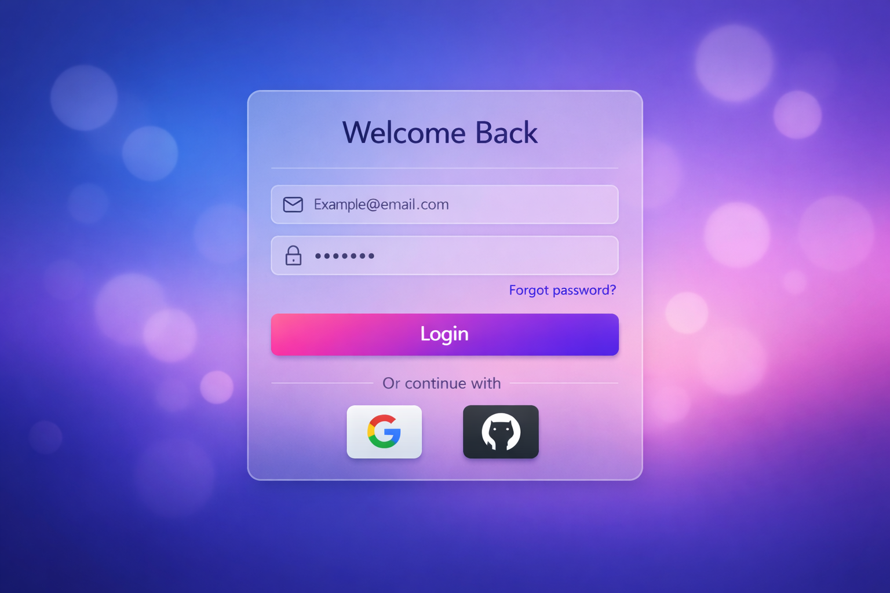
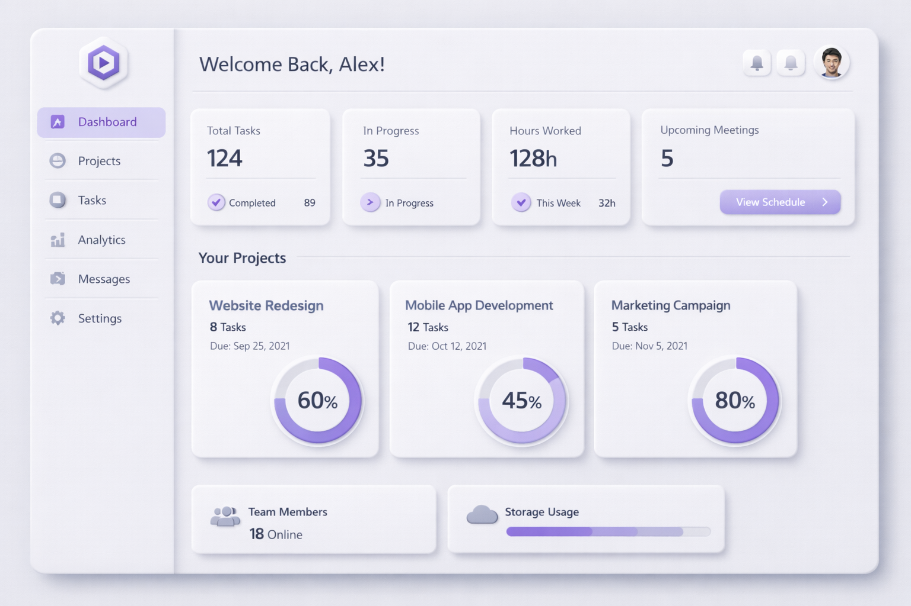

# 设计测试仓库 (Design Test Repository)

一个个人 UI/UX 设计练习与原型实验仓库。记录从视觉探索到代码实现的完整过程。

## 🚀 项目目标

- **练习主流设计系统**：Material 3、Fluent、Neumorphism、Glassmorphism 等。
- **从设计到代码**：将 Figma 视觉稿转化为高质量的 HTML/CSS 代码。
- **测试交互反馈**：探索微交互与动画效果。
- **积累个人作品集**：展示设计思维与技术实现能力。

---

## 🎨 作品展示

### 1. Gradient Minimal Login (Material 3 风格)
渐变背景 + 玻璃态卡片 + 微交互 hover 效果，提升沉浸感。

- **设计决策**：主色采用 #6366F1 → #A78BFA 渐变，卡片使用 `backdrop-filter: blur(16px)`。
- **代码实现**：[查看代码](./designs/01-gradient-login/) | [详细说明](./designs/01-gradient-login/README.md)

### 2. Neumorphism Card Dashboard (新拟物化风格)
通过精确的阴影与高光处理，营造出柔和、具有 3D 质感的“软 UI”界面。

- **设计决策**：背景色 #E0E5EC，通过双重阴影（浅色高光与深色阴影）实现挤压感。
- **代码实现**：[查看代码](./designs/02-neumorphism-dashboard/) | [详细说明](./designs/02-neumorphism-dashboard/README.md)

---

## 📅 更新日志

详细更新历史请参阅 [CHANGELOG.md](./CHANGELOG.md)。

- **v1.1.0 (2026-03-12)**: 
  - 自动化贡献系统集成。
  - 完善项目文档与版本管理。
- **v1.0.0 (2026-03-09)**: 
  - 发布 **Gradient Minimal Login** 和 **Neumorphism Card Dashboard**。
  - 初始版本发布。

## 🛠️ 工具栈

- **设计**：Figma, Adobe XD
- **前端**：HTML5, CSS3 (Flexbox/Grid), Google Fonts
- **版本控制**：GitHub
- **自动化**：Manus AI Automation

## 🤝 如何使用 / 贡献

1. Fork 本仓库
2. Clone 到本地：`git clone https://github.com/Ava12131/design-test.git`
3. 创建新分支实验你的想法
4. PR 回来分享你的设计 / 代码 / 建议！

---

**最后**：这是一个公开的个人练习本，任何 star / fork 都是对我最大的鼓励～
