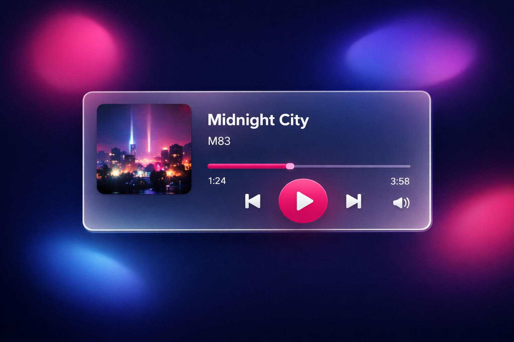

# Glassmorphism Music Player

这是一个基于玻璃态 (Glassmorphism) 风格的音乐播放器界面设计。

## 设计特点
- **强模糊背景**：使用 `backdrop-filter: blur(20px)` 营造出磨砂玻璃的质感。
- **深色模式优化**：针对暗色背景设计的 UI 元素，具有极高的视觉吸引力。
- **霓虹色彩点缀**：使用鲜艳的粉色 (#FF2D55) 作为主色调，增加未来感。
- **层次感设计**：通过半透明边框和阴影，使播放器卡片在动态背景上脱颖而出。

## 技术栈
- HTML5
- CSS3 (Flexbox, Backdrop-filter, CSS Animations)
- Google Fonts (Outfit)
- Font Awesome (Icons)

## 预览

## 如何运行
直接在浏览器中打开 `index.html` 即可查看效果。
